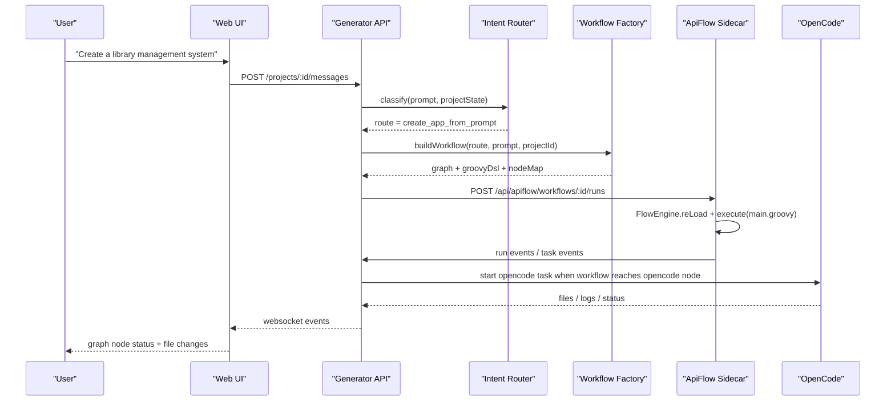

# AI App Generator MVP

This directory is the isolated project workspace for the AI application generation platform MVP.

All future source code, Git commits, implementation plans, and project documentation should live under this directory. The parent course directory contains videos, PDFs, archives, extracted frames, and reference materials; those files must not be committed to this project repository.

## MVP Goal

Build a Web Studio where a user can describe an application, start a local code Agent, stream generation logs, inspect generated files, and preview the generated app.

## Phase 6 ApiFlow Routing

Generator API owns intent routing, workflow construction, project state, and OpenCode orchestration. ApiFlow receives a generated workflow DSL from the API, runs it through the long-lived sidecar service, and reports run/task events back to the API so the UI can render workflow status as a graph.

Current implementation status: prompt-driven workflow generation, ApiFlow sidecar run start/status polling, `/internal/agent-runs`, `/internal/apiflow-events`, sidecar event polling, and live workflow node status rendering are implemented. Remaining Phase 6 work is real ApiFlow task event emission, durable workflow event/log history, cancellation propagation, and broader node coverage.



## Repository Boundary

Git must be initialized and used from this directory:

```powershell
cd <project-root>
git status
```

Do not run `git add` or `git commit` from the parent course directory.

Parent course files, videos, and docs are outside this Git repository boundary and must not be committed.

## Local Development

See [docs/local-development.md](docs/local-development.md) for the local workflow with the fake agent and OpenCode provider.

## Developer Documentation

- [Product requirements](docs/product-requirements.md)
- [ApiFlow project routing design](docs/superpowers/specs/2026-06-24-apiflow-project-routing-design.md)
- [Implementation guide](docs/implementation-guide.md)
- [Development standards](docs/development-standards.md)
- [Phase roadmap and status](docs/phase-roadmap.md)
- [Developer onboarding](docs/developer-onboarding.md)

Detailed historical plans are under [docs/superpowers/plans](docs/superpowers/plans).

## Planned Structure

```text
apps/
  api/
  web/
packages/
  shared/
templates/
  react-vite/
  vue-vite/
docs/
  superpowers/
    specs/
    plans/
workspaces/
```

`workspaces/` is ignored because it will contain generated applications and runtime output.
