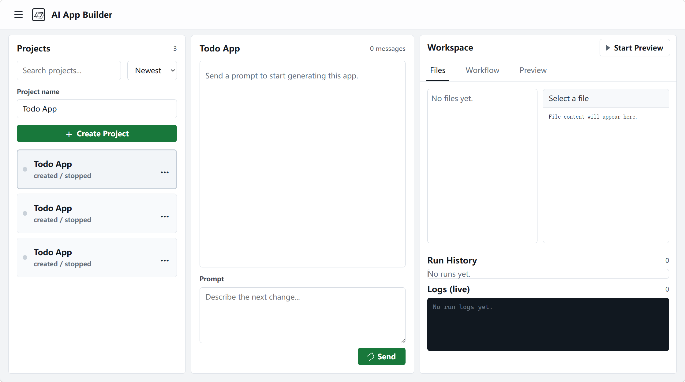

# AI App Generator

一个 AI 驱动的应用生成平台，开发者通过对话描述需求，AI Agent 实时编写代码并预览运行结果。



## MVP Goal

Build a Web Studio where a user can describe an application, start a local code Agent, stream generation logs, inspect generated files, and preview the generated app.

## 核心架构：双流程引擎

### 1. 开发流程 - AI 代码生成

```text
开发者 -> Web Studio (Generator)
             |
             | OpenCode CLI / Agent process
             v
        OpenCode 进程 -> 沙箱内读写项目文件
             |
             | 实时流式返回
             v
        Web Studio UI <- 逐条展示生成日志
```

- 开发者在 Web Studio 对话框中用自然语言描述应用需求。
- Generator 为每次生成运行启动独立的 OpenCode 进程。
- 用户消息转发给 OpenCode，OpenCode 实时返回生成/修改日志，并流式推送到前端界面。
- Agent 只读写对应项目目录下的文件。
- 不同项目可以并行运行；同一项目的写入型生成运行由后端串行控制。

### 2. 运行流程 - ApiFlow 引擎

```text
用户 -> 浏览器 / API -> Generator API -> ApiFlow Sidecar -> FlowEngine
                              |
                              v
                         OpenCode / project workspace
```

- Generator API 是项目状态、工作目录、运行记录和浏览器事件的系统边界。
- ApiFlow Sidecar 作为长驻 Java 服务执行生成出的 Groovy DSL。
- ApiFlow 不直接定位或修改项目目录；需要写文件时通过 Generator API 触发 OpenCode。
- Sidecar 运行状态和任务事件回传给 Generator API，再由 Generator API 推送到 Web UI。

## Repository Boundary

Git must be initialized and used from this directory:

```powershell
cd <project-root>
git status
```

Do not run `git add` or `git commit` from the parent course directory.

Parent course files, videos, archives, extracted frames, and the external `20250725_apiFlow` source tree are outside this Git repository boundary and must not be committed.

## 仓库结构

```text
apps/
  api/                  # 后端 API 服务：项目编排、Agent 调度、ApiFlow runtime adapter
  web/                  # 前端 Web Studio：对话、文件浏览、预览、工作流编辑
  apiflow-sidecar/      # Java sidecar wrapper；不包含外部 ApiFlow 源码
packages/
  shared/               # 共享类型与工具
templates/
  react-vite/           # 内置 React 模板
  vue-vite/             # 内置 Vue 模板
docs/
  superpowers/          # 设计规格与实现计划
workspaces/             # 生成的应用运行时目录，已 gitignore
```

## 本地开发

```powershell
# 安装依赖
npm install

# 启动 API 服务
npm run dev:api

# 启动前端
npm run dev:web

# 启动 ApiFlow sidecar
npm run dev:apiflow
```

See [docs/local-development.md](docs/local-development.md) for detailed local workflow setup.

## Developer Documentation

- [Product requirements](docs/product-requirements.md)
- [ApiFlow project routing design](docs/superpowers/specs/2026-06-24-apiflow-project-routing-design.md)
- [Implementation guide](docs/implementation-guide.md)
- [Development standards](docs/development-standards.md)
- [Phase roadmap and status](docs/phase-roadmap.md)
- [Developer onboarding](docs/developer-onboarding.md)

Detailed historical plans are under [docs/superpowers/plans](docs/superpowers/plans).
