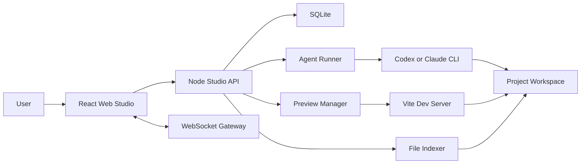

# AI App Generator MVP Design

## Summary

Build the first slice of the AI application generation platform shown in the reference video: a Web Studio where a user describes an app, the backend starts a local code Agent in an isolated project workspace, logs stream back in real time, generated files can be inspected, and the app can be previewed through a local dev server.

This MVP intentionally does not include the full ApiFlow Java/Groovy workflow engine, visual workflow authoring, template marketplace, multi-user billing, or production deployment. Those are later phases after the generation loop is reliable.

## Goals

- Let a user create a project from a browser UI.
- Let a user send a natural-language app request to an Agent.
- Start one Agent run inside only that project's workspace.
- Stream Agent output and lifecycle events to the frontend through WebSocket.
- Show generated project files in the frontend.
- Start a local preview server and display the preview URL.
- Persist projects, conversations, messages, Agent runs, and logs.

## Non-Goals

- No public internet deployment in MVP.
- No multi-tenant security model beyond local workspace isolation.
- No full visual workflow canvas in MVP.
- No Java ApiFlow engine integration in MVP.
- No production-grade sandboxing, quotas, or billing.
- No template marketplace UI; use one built-in frontend template.

## Product Scope

The first screen is the working Studio, not a marketing page. The UI has three primary areas:

- Project area: project list, create project, current project status.
- Conversation area: prompt input, assistant/Agent messages, live run logs.
- Workspace area: file tree, file viewer, preview status, preview link.

The MVP user journey is:

1. User creates a project.
2. System copies a built-in Vite React template into `workspaces/{projectId}`.
3. User enters a request such as "build a todo app with filtering and local storage".
4. Backend creates an `agent_run`.
5. Agent Runner starts a configured CLI command inside the project workspace.
6. Backend streams stdout, stderr, and status events over WebSocket.
7. Backend refreshes the file tree after the run completes.
8. Backend starts the preview dev server.
9. Frontend shows the preview URL and generated files.

## Recommended Architecture

The backend owns orchestration. The frontend never starts shell commands directly. The Agent only receives a working directory scoped to one project.

## Technology Choices

- Frontend: React, Vite, TypeScript, Tailwind CSS, Monaco Editor later if needed.
- Backend: Node.js, TypeScript, Fastify, `@fastify/websocket` or `ws`.
- Database: SQLite for MVP.
- Agent execution: Node `child_process.spawn`.
- Workspace storage: local filesystem under `workspaces/{projectId}`.
- Preview: per-project Vite dev server on an allocated localhost port.
- Package manager: npm for the first slice.

## Backend Modules

### Project Service

Responsibilities:

- Create projects.
- Copy the built-in starter template.
- Store project metadata.
- Resolve the absolute workspace path for a project.
- Prevent path traversal by rejecting any file access outside the workspace root.

### Conversation Service

Responsibilities:

- Create a conversation per project.
- Persist user and assistant messages.
- Attach messages to Agent runs.

### Agent Runner

Responsibilities:

- Create an `agent_run` record.
- Build the Agent prompt from the user's request and project constraints.
- Start the configured CLI in the project workspace.
- Stream stdout and stderr as structured log events.
- Mark runs as `queued`, `running`, `succeeded`, `failed`, or `cancelled`.
- Allow a running process to be stopped.

The initial implementation should support one active Agent run per project. If a second request arrives while a run is active, return a conflict error.

### WebSocket Gateway

Responsibilities:

- Let the frontend subscribe to a project channel.
- Broadcast run status changes.
- Broadcast Agent logs.
- Broadcast file-tree refresh events.
- Broadcast preview status changes.

### File Service

Responsibilities:

- Return a file tree for a project.
- Read a file by relative path.
- Ignore heavy or unsafe paths such as `node_modules`, `.git`, `dist`, `.env`, and lock/cache directories.
- Limit file read size for the UI.

### Preview Manager

Responsibilities:

- Install dependencies if needed.
- Start `npm run dev -- --host 127.0.0.1 --port {port}` in the project workspace.
- Track process ID and port.
- Stop preview processes.
- Return preview URL.

MVP can start preview only after an Agent run succeeds. Later versions can keep preview hot while files change.

## Data Model

### `projects`

- `id`: text primary key
- `name`: text
- `slug`: text unique
- `workspace_path`: text
- `status`: text, one of `created`, `generating`, `ready`, `error`
- `preview_port`: integer nullable
- `preview_status`: text, one of `stopped`, `starting`, `running`, `error`
- `created_at`: datetime
- `updated_at`: datetime

### `conversations`

- `id`: text primary key
- `project_id`: text
- `created_at`: datetime
- `updated_at`: datetime

### `messages`

- `id`: text primary key
- `conversation_id`: text
- `role`: text, one of `user`, `assistant`, `system`
- `content`: text
- `agent_run_id`: text nullable
- `created_at`: datetime

### `agent_runs`

- `id`: text primary key
- `project_id`: text
- `conversation_id`: text
- `status`: text, one of `queued`, `running`, `succeeded`, `failed`, `cancelled`
- `prompt`: text
- `command`: text
- `exit_code`: integer nullable
- `error_message`: text nullable
- `started_at`: datetime nullable
- `finished_at`: datetime nullable
- `created_at`: datetime

### `agent_logs`

- `id`: text primary key
- `agent_run_id`: text
- `stream`: text, one of `stdout`, `stderr`, `event`
- `content`: text
- `sequence`: integer
- `created_at`: datetime

## API Surface

### Projects

- `POST /api/projects`
  - Body: `{ "name": "Todo App" }`
  - Creates a project from the built-in template.

- `GET /api/projects`
  - Returns project summaries.

- `GET /api/projects/:projectId`
  - Returns project detail and preview status.

### Conversation

- `GET /api/projects/:projectId/messages`
  - Returns conversation messages.

- `POST /api/projects/:projectId/messages`
  - Body: `{ "content": "Build a todo app..." }`
  - Creates a user message and starts an Agent run.

### Agent Runs

- `GET /api/projects/:projectId/runs`
  - Returns Agent run history.

- `POST /api/projects/:projectId/runs/:runId/cancel`
  - Stops a running Agent process.

### Files

- `GET /api/projects/:projectId/files`
  - Returns file tree.

- `GET /api/projects/:projectId/files/content?path=src/App.tsx`
  - Returns file content.

### Preview

- `POST /api/projects/:projectId/preview/start`
  - Starts preview server.

- `POST /api/projects/:projectId/preview/stop`
  - Stops preview server.

### WebSocket

- `GET /ws?projectId={projectId}`
  - Server emits JSON events:
    - `run.status`
    - `run.log`
    - `files.changed`
    - `preview.status`
    - `error`

## Agent Prompt Contract

The Agent prompt must be constrained:

- Work only in the current project directory.
- Prefer editing the existing Vite React app.
- Keep generated app runnable with `npm install` and `npm run dev`.
- Do not read or modify files outside the workspace.
- Do not add backend services unless the user explicitly asks.
- Keep implementation simple and inspectable.
- After changes, run the available checks if dependencies are installed.

The configured CLI command should be externalized in environment variables, for example:

- `AGENT_COMMAND=codex`
- `AGENT_ARGS=exec --skip-git-repo-check`

The exact command may differ depending on the local Agent installed on the machine. The Runner should make this configurable instead of hard-coding one provider.

## Error Handling

- If project creation fails, delete the partially-created workspace and return a clear error.
- If an Agent command is not configured, return `500` with setup guidance.
- If an Agent run exits non-zero, mark the run `failed`, store stderr, and keep the workspace for inspection.
- If preview startup fails, mark preview `error` and show the command output.
- If WebSocket disconnects, the run continues and logs remain queryable from the database.
- If a file path escapes the workspace root, return `400`.
- If a project already has an active run, return `409`.

## Security And Isolation

MVP isolation is local and conservative, not production-grade:

- Resolve every project path against the configured workspace root.
- Deny absolute file paths from API callers.
- Deny `..` traversal after path normalization.
- Never expose `.env`, `.git`, `node_modules`, cache folders, or operating-system files through the file API.
- Run Agent and preview processes with the project workspace as `cwd`.
- Record all shell commands launched by the backend.

Production hardening later should use containers or separate OS users per workspace.

## Testing Strategy

Backend tests:

- Project creation copies the template and writes metadata.
- File API rejects path traversal.
- Agent Runner records logs and statuses for a fake command.
- Agent Runner prevents concurrent runs in one project.
- WebSocket broadcasts run logs to subscribed clients.
- Preview Manager records failure output when `npm run dev` fails.

Frontend tests:

- Project list renders projects.
- Sending a prompt appends the user message and starts a run.
- Run logs append in order.
- File tree selection loads file content.
- Preview status is displayed.

Manual acceptance test:

1. Start backend and frontend.
2. Create a project named "Todo App".
3. Send "Build a todo app with add, complete, delete, and filter controls".
4. Confirm live logs appear.
5. Confirm generated files appear in the file tree.
6. Start preview.
7. Open preview URL and confirm the generated app runs.

## Phased Delivery

### Phase 1: Local MVP Loop

- Backend API skeleton.
- SQLite schema.
- Project template copy.
- Agent Runner with fake command test mode.
- WebSocket log streaming.
- React Studio shell.
- File tree and file viewer.
- Preview manager.

### Phase 2: Real Agent Integration

- Configure local Codex or Claude CLI.
- Build robust prompt wrapper.
- Capture run logs and failures.
- Add cancel/retry.
- Add run history.

### Phase 3: Better Studio UX

- Improve project navigation.
- Add Monaco file viewer.
- Add terminal-style log panel.
- Add preview iframe.
- Add loading, empty, and error states.

### Phase 4: Templates And Tools

- Add built-in React and Vue templates.
- Add template metadata.
- Add controlled tool definitions for shell, file, install, and build.
- Add audit history for tool calls.

### Phase 5: Visual Workflow And ApiFlow

- Add React Flow canvas.
- Add nodes for input, Agent, HTTP, condition, and deployment.
- Export a workflow definition.
- Connect Java/Groovy ApiFlow as an execution backend.

### Phase 6: Deployment Model

- Add build output hosting.
- Add NGINX routing.
- Add per-project subdomain or path routing.
- Add user accounts and project ownership.

## Acceptance Criteria For MVP

- A user can create a project from the Web Studio.
- A user can submit a natural-language app request.
- The backend starts exactly one Agent process for that project.
- Logs stream to the browser while the process runs.
- Run status is persisted.
- Generated files are visible in the file tree.
- File content can be viewed.
- Preview can be started and returns a usable local URL.
- Path traversal is blocked.
- A failed Agent run leaves inspectable logs and does not crash the server.

## Open Decisions

- Which local Agent CLI is available on the target machine: Codex, Claude Code, or both.
- Whether the first implementation should be a monorepo with `apps/web` and `apps/api`, or a simpler two-folder layout.
- Whether to use Fastify directly or NestJS.
- Whether the MVP should start preview automatically after success or require a button click.

Recommended defaults:

- Use a monorepo with `apps/web`, `apps/api`, `packages/shared`, `templates/react-vite`, and `workspaces`.
- Use Fastify directly for speed and less framework overhead.
- Start preview with an explicit button first, then add auto-start later.
- Make Agent command configurable so the MVP can run with a fake command during development and with Codex/Claude when installed.
