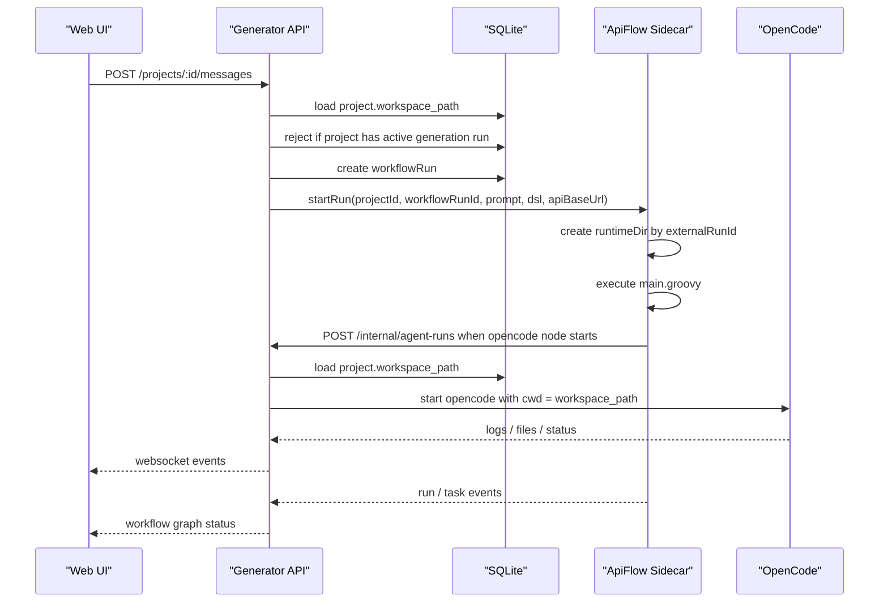

# ApiFlow Project Routing Design

## Goal

Define how the generator routes a user project request to ApiFlow, how ApiFlow finds the correct project context, and how multiple projects can build at the same time without corrupting workspaces.

## Decision

Generator API owns project/workspace mapping, intent routing, workflow construction, run persistence, OpenCode orchestration, and browser events. ApiFlow sidecar owns workflow execution only.

ApiFlow sidecar must not infer or discover the current project directory. It receives explicit run context from Generator API and calls Generator API for any operation that mutates project files.

## Runtime Topology



## Responsibilities

### Generator API

Generator API is the system of record for project state.

It owns:

- `projectId -> workspacePath`
- conversation/message records
- local `workflowRunId`
- sidecar `externalRunId`
- active-run locks
- OpenCode process startup
- file watching and preview state
- WebSocket fan-out to the browser

It decides whether a user prompt should route to:

```ts
type GenerationRoute =
  | "create_app_from_prompt"
  | "modify_app_from_prompt"
  | "run_existing_workflow"
  | "preview_project"
  | "chat_only";
```

### Workflow Factory

Workflow Factory converts a route and user prompt into a structured workflow.

It should emit the graph and DSL from the same intermediate representation:

```ts
interface GeneratedWorkflow {
  graph: WorkflowGraph;
  dsl: string;
  nodeMap: Record<string, string>;
}
```

`nodeMap` maps ApiFlow task names back to UI node IDs:

```ts
{
  "task_parse_request": "node_parse_request",
  "task_run_opencode": "node_run_opencode"
}
```

Generator-created workflows should not be parsed back from Groovy to build their graph. The graph is generated from the same IR as the Groovy DSL.

### ApiFlow Sidecar

ApiFlow sidecar is a long-lived Java service. It executes DSL runs and emits run/task events.

It owns:

- `externalRunId`
- per-run runtime directory
- in-memory or persisted sidecar run status
- ApiFlow `FlowEngine` lifecycle for each run
- event sequencing for sidecar events

It does not own:

- project workspace lookup
- direct OpenCode process management
- project file mutation
- browser WebSocket fan-out
- user/project authorization

## Start Run Contract

Generator API sends a start request to sidecar:

```ts
interface ApiFlowStartRunRequest {
  workflowId: string;
  workflowName: string;
  dsl: string;
  input: {
    projectId: string;
    workflowRunId: string;
    conversationId: string | null;
    prompt: string;
    apiBaseUrl: string;
  };
}
```

`workspacePath` is intentionally omitted from the default contract. The sidecar should call Generator API when a workflow node needs to mutate files.

A read-only file inspection node may receive a scoped path later, but write access should stay behind Generator API.

## Project Directory Resolution

Project directory resolution happens only in Generator API:

```text
projectId -> projects.workspace_path -> OpenCode cwd
```

When ApiFlow reaches an OpenCode node, it calls an internal Generator API endpoint:

```http
POST /internal/agent-runs
Content-Type: application/json

{
  "projectId": "project_123",
  "workflowRunId": "workflow_run_123",
  "nodeId": "node_run_opencode",
  "prompt": "Create a library management system"
}
```

Generator API then:

1. Loads `projects.workspace_path`.
2. Checks the active-run lock for that project.
3. Starts OpenCode with `cwd = workspace_path`.
4. Records logs and file changes.
5. Publishes WebSocket events.

## Runtime Directory Isolation

Sidecar runtime files are isolated by `externalRunId`:

```text
storage/apiflow-runs/
  apiflow-a1/
    api/main.groovy
  apiflow-b1/
    api/main.groovy
```

Do not write generated DSL under a shared `workflowId` directory for execution. The same workflow can be run multiple times concurrently, and `workflowId`-scoped files can overwrite each other.

## Concurrency Rules

Use this concurrency model:

```text
same project: serial generation runs
different projects: parallel generation runs
same workflow: parallel runs allowed when project locks permit
```

Generator API enforces project-level write locks:

```ts
interface ActiveProjectRun {
  projectId: string;
  workflowRunId: string;
  status: "queued" | "running";
}
```

Before starting a generation run, Generator API rejects a second active run for the same project with HTTP `409`.

Sidecar supports multiple active `externalRunId` values:

```ts
interface SidecarRunState {
  externalRunId: string;
  workflowId: string;
  projectId: string;
  workflowRunId: string;
  status: "queued" | "running" | "succeeded" | "failed" | "cancelled";
  runtimeDir: string;
  createdAt: string;
}
```

## Event Routing

Sidecar emits events to Generator API, not directly to the browser:

```http
POST /internal/workflow-runs/:workflowRunId/events
```

Example event:

```json
{
  "externalRunId": "apiflow-a1",
  "type": "task.started",
  "taskName": "task_run_opencode",
  "nodeId": "node_run_opencode",
  "sequence": 12,
  "createdAt": "2026-06-24T10:00:00.000Z"
}
```

Generator API maps sidecar events to browser events:

```text
taskName -> nodeMap[taskName] -> workflow.node.status
```

If a sidecar event has no mapped node, Generator API stores it as run log metadata and does not fail the run.

## Nginx Role

Nginx can be used as a network gateway after Phase 6 stabilizes:

```text
/          -> apps/web
/api/*     -> Generator API
/ws        -> Generator API WebSocket
/preview/* -> preview proxy
```

Nginx must not decide whether a prompt routes to ApiFlow. Business routing remains in Generator API.

ApiFlow sidecar should not be exposed directly to browser clients. It is an internal service called by Generator API.

## Error Handling

Generator API returns `409` when a project already has an active generation run.

Sidecar returns:

- `202` when a run is accepted.
- `404` when `externalRunId` is unknown.
- `400` when DSL or request shape is invalid.
- `500` when ApiFlow execution fails before producing a structured failure event.

Generator API converts sidecar failures into local workflow run failures and publishes `workflow.run.status` events.

OpenCode failures are recorded by Generator API as agent run failures and then mapped back to the workflow node that requested the OpenCode run.

## Acceptance Criteria

- User prompt reaches Generator API through the normal message route.
- Generator API determines a `GenerationRoute`.
- Generator API creates a workflow graph, DSL, and `nodeMap`.
- Sidecar receives a run request without needing to query project directories.
- Sidecar writes DSL to `storage/apiflow-runs/<externalRunId>/api/main.groovy`.
- ApiFlow runs for different projects can execute concurrently.
- Two active generation runs for the same project are rejected or queued by Generator API.
- OpenCode always starts from `projects.workspace_path`.
- Browser receives status through Generator API WebSocket events.
- ApiFlow source remains outside the main repository.

## Implementation Plan Links

- `docs/superpowers/plans/2026-06-24-phase6-main-project-sidecar.md`
- `docs/superpowers/plans/2026-06-24-phase6-apiflow-source-extension.md`
- `docs/superpowers/plans/2026-06-24-phase6-end-to-end-integration.md`
